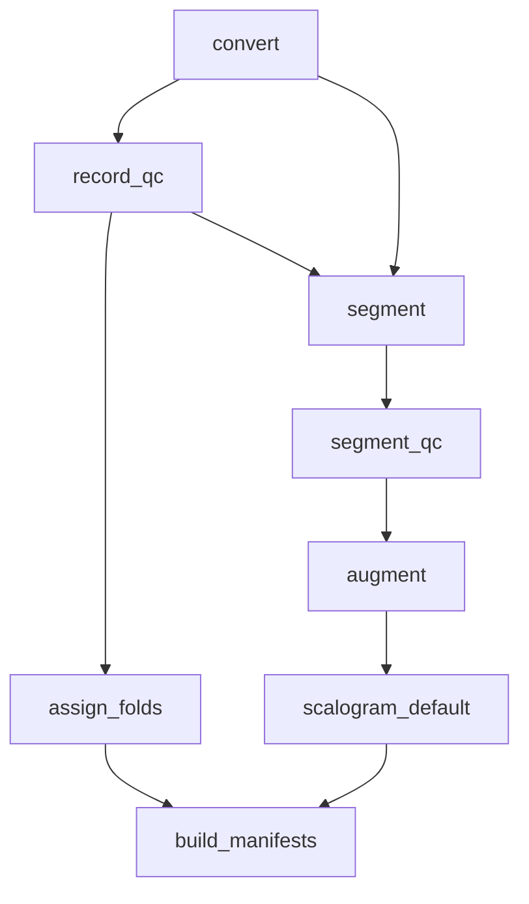

```mermaid
flowchart TD
	node1["assign_folds"]
	node2["augment"]
	node3["build_manifests"]
	node4["convert"]
	node5["record_qc"]
	node6["scalogram_default"]
	node7["segment"]
	node8["segment_qc"]
	node1-->node3
	node2-->node6
	node4-->node5
	node4-->node7
	node5-->node1
	node5-->node7
	node6-->node3
	node7-->node8
	node8-->node2
```

